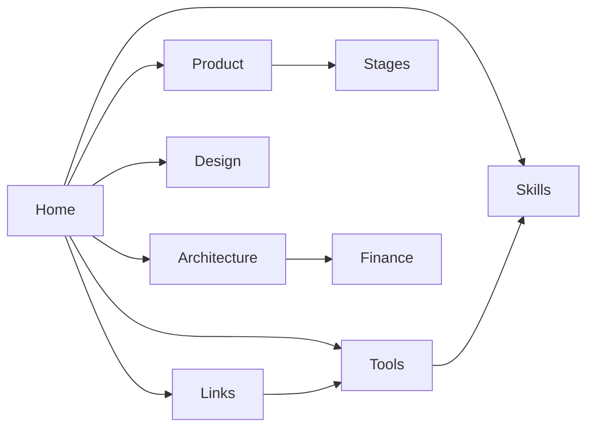

# BLACKBOX · Brain

> Private-vault knowledge base for the **Obsidian Atelier** lifestyle affordability product.
> Open this folder as an Obsidian vault. Navigate with `[[wikilinks]]`, Graph, and tags.

## Maps of content

| Map | What lives here |
|-----|-----------------|
| [[MOC - Product]] | Vision, acts, stage film, UX principles |
| [[MOC - Architecture]] | Files, runtime, APIs, data flow |
| [[MOC - Design]] | Atelier system, tokens, consistency rules |
| [[MOC - Tools]] | Dev tools, libraries, MCP, CLIs |
| [[MOC - Skills]] | Repeatable craft procedures |
| [[MOC - Links]] | External + internal link garden |
| [[MOC - Stages]] | All 11 journey stages |
| [[MOC - Finance]] | Projection math, money format, loans |

## Start here

1. Product north star → [[Product Vision]]
2. How the film works → [[Journey Film]]
3. How money is calculated → [[Projection Engine]]
4. How to ship a UI pass → [[Skill - Visual Consistency Pass]]
5. Reference links → [[Links Hub]]

## Vault conventions

- **Wikilinks** for all internal notes: `[[Note Name]]`
- **Tags** for type: `#tool` `#skill` `#link` `#stage` `#finance` `#decision`
- **Frontmatter** `tags`, `aliases`, `updated` on every note
- **Decisions** live in `09 Decisions/` as ADRs
- **Assets** (screenshots, sketches) go in `assets/`

## Related repo docs

- [README](../../README.md)
- [Vectrfl Migration Plan](../../docs/VECTRFL_MIGRATION_PLAN.md)
- [Migration status board](../../docs/vectrfl-migration-plan.html)

---

*Last rebuilt: 2026-07-11 · open with Obsidian → Open folder as vault → `blackbox/brain`*
